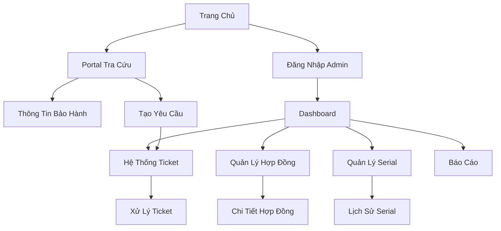

# Tài Liệu Yêu Cầu Sản Phẩm - Hệ Thống Quản Lý Bảo Hành

## 1. Tổng Quan Sản Phẩm

Hệ thống web quản lý bảo hành sản phẩm toàn diện giúp doanh nghiệp quản lý hiệu quả các hợp đồng bảo hành, theo dõi serial number sản phẩm và xử lý yêu cầu bảo hành từ khách hàng.

Hệ thống giải quyết bài toán quản lý bảo hành phức tạp cho các doanh nghiệp có nhiều sản phẩm, giúp tối ưu hóa quy trình xử lý và nâng cao trải nghiệm khách hàng.

Mục tiêu: Số hóa hoàn toàn quy trình quản lý bảo hành, giảm 70% thời gian xử lý và tăng 50% độ hài lòng khách hàng.

## 2. Tính Năng Cốt Lõi

### 2.1 Vai Trò Người Dùng

| Vai Trò | Phương Thức Đăng Ký | Quyền Hạn Cốt Lõi |
|---------|---------------------|--------------------|
| Khách Hàng | Đăng ký email hoặc tra cứu không cần đăng ký | Tra cứu bảo hành, tạo yêu cầu bảo hành, xem lịch sử |
| Nhân Viên | Tài khoản được cấp bởi Admin | Xử lý yêu cầu bảo hành, cập nhật trạng thái, tạo báo cáo |
| Quản Lý | Tài khoản được cấp bởi Admin | Quản lý hợp đồng, phê duyệt yêu cầu, xem báo cáo tổng hợp |
| Admin | Tài khoản root | Toàn quyền hệ thống, quản lý người dùng, cấu hình hệ thống |

### 2.2 Module Tính Năng

Hệ thống quản lý bảo hành bao gồm các trang chính sau:

1. **Trang Chủ**: hero section giới thiệu dịch vụ, navigation menu, form tra cứu nhanh serial
2. **Portal Tra Cứu**: form nhập serial number, hiển thị thông tin bảo hành, hướng dẫn quy trình
3. **Dashboard Quản Trị**: thống kê tổng quan, biểu đồ, danh sách cảnh báo, báo cáo nhanh
4. **Quản Lý Hợp Đồng**: danh sách hợp đồng, form tạo/chỉnh sửa, chi tiết hợp đồng
5. **Quản Lý Serial**: đăng ký serial, liên kết hợp đồng, lịch sử bảo hành
6. **Hệ Thống Ticket**: danh sách yêu cầu, workflow xử lý, giao tiếp với khách hàng
7. **Báo Cáo**: các loại báo cáo thống kê, export dữ liệu, biểu đồ phân tích
8. **Quản Lý Người Dùng**: phân quyền, tạo tài khoản, audit log
9. **Cài Đặt Hệ Thống**: cấu hình email, template thông báo, backup

### 2.3 Chi Tiết Trang

| Tên Trang | Tên Module | Mô Tả Tính Năng |
|-----------|------------|------------------|
| Trang Chủ | Hero Section | Hiển thị banner giới thiệu dịch vụ bảo hành, slogan, hình ảnh minh họa |
| Trang Chủ | Form Tra Cứu Nhanh | Nhập serial number để tra cứu nhanh, validation input, chuyển hướng kết quả |
| Trang Chủ | Navigation Menu | Menu điều hướng responsive, đăng nhập/đăng xuất, ngôn ngữ |
| Portal Tra Cứu | Form Tra Cứu Chi Tiết | Nhập serial/mã hợp đồng, hiển thị thông tin sản phẩm, thời hạn bảo hành |
| Portal Tra Cứu | Thông Tin Bảo Hành | Hiển thị chi tiết sản phẩm, ngày hết hạn, điều khoản, lịch sử sửa chữa |
| Portal Tra Cứu | Form Yêu Cầu Bảo Hành | Tạo ticket bảo hành online, upload hình ảnh, mô tả lỗi, thông tin liên hệ |
| Dashboard | Thống Kê Tổng Quan | Widget hiển thị số liệu: tổng hợp đồng, sắp hết hạn, yêu cầu chờ xử lý |
| Dashboard | Biểu Đồ Phân Tích | Chart thống kê theo thời gian, loại sản phẩm, trạng thái xử lý |
| Dashboard | Danh Sách Cảnh Báo | Alert sản phẩm sắp hết hạn, yêu cầu quá hạn, thông báo hệ thống |
| Quản Lý Hợp Đồng | Danh Sách Hợp Đồng | Table hiển thị hợp đồng, filter, search, pagination, sort |
| Quản Lý Hợp Đồng | Form Tạo/Sửa Hợp Đồng | Form nhập thông tin khách hàng, sản phẩm, thời hạn, điều khoản |
| Quản Lý Hợp Đồng | Chi Tiết Hợp Đồng | Hiển thị đầy đủ thông tin, danh sách sản phẩm, lịch sử thay đổi |
| Quản Lý Serial | Đăng Ký Serial | Form nhập serial, liên kết sản phẩm, thông tin sản xuất, QR code |
| Quản Lý Serial | Danh Sách Serial | Table quản lý serial, trạng thái, liên kết hợp đồng, tìm kiếm |
| Quản Lý Serial | Lịch Sử Bảo Hành | Timeline hiển thị lịch sử sửa chữa, thay thế, bảo dưỡng |
| Hệ Thống Ticket | Danh Sách Yêu Cầu | Table ticket với filter trạng thái, độ ưu tiên, nhân viên xử lý |
| Hệ Thống Ticket | Chi Tiết Ticket | Thông tin yêu cầu, timeline xử lý, chat với khách hàng, cập nhật trạng thái |
| Hệ Thống Ticket | Workflow Xử Lý | Kanban board theo trạng thái: mới → đang xử lý → hoàn thành |
| Báo Cáo | Báo Cáo Doanh Thu | Chart doanh thu bảo hành theo tháng/quý/năm, export Excel/PDF |
| Báo Cáo | Thống Kê Sản Phẩm | Top sản phẩm lỗi nhiều, thời gian xử lý trung bình, tỷ lệ hài lòng |
| Báo Cáo | Hiệu Quả Xử Lý | KPI nhân viên, thời gian phản hồi, tỷ lệ giải quyết đúng hạn |
| Quản Lý Người Dùng | Danh Sách Người Dùng | Table user với vai trò, trạng thái, ngày tạo, hoạt động cuối |
| Quản Lý Người Dùng | Phân Quyền | Matrix phân quyền theo vai trò, cấp/thu hồi quyền, audit log |
| Cài Đặt | Cấu Hình Email | Template email thông báo, SMTP settings, test gửi mail |
| Cài Đặt | Backup & Restore | Lịch backup tự động, restore dữ liệu, monitor dung lượng |

## 3. Quy Trình Cốt Lõi

### Quy Trình Khách Hàng:
1. Khách hàng truy cập portal tra cứu
2. Nhập serial number hoặc mã hợp đồng
3. Xem thông tin bảo hành và hướng dẫn
4. Tạo yêu cầu bảo hành nếu cần
5. Theo dõi tiến độ xử lý qua email/SMS

### Quy Trình Admin:
1. Đăng nhập dashboard quản trị
2. Tạo hợp đồng bảo hành mới
3. Đăng ký serial number cho sản phẩm
4. Xử lý yêu cầu bảo hành từ khách hàng
5. Tạo báo cáo và thống kê

## 4. Thiết Kế Giao Diện

### 4.1 Phong Cách Thiết Kế

- **Màu sắc chính**: #2563eb (xanh dương chuyên nghiệp), #f8fafc (xám nhạt nền)
- **Màu sắc phụ**: #10b981 (xanh lá thành công), #ef4444 (đỏ cảnh báo), #f59e0b (vàng chờ xử lý)
- **Kiểu button**: Rounded corners (8px), shadow subtle, hover effects
- **Font chữ**: Inter (primary), size 14px-16px cho nội dung, 24px-32px cho tiêu đề
- **Layout**: Card-based design, sidebar navigation, top header với breadcrumb
- **Icons**: Heroicons outline style, size 20px-24px, màu #6b7280

### 4.2 Tổng Quan Thiết Kế Trang

| Tên Trang | Tên Module | Thành Phần UI |
|-----------|------------|---------------|
| Trang Chủ | Hero Section | Background gradient, typography lớn, CTA button nổi bật, responsive grid |
| Portal Tra Cứu | Form Tra Cứu | Card container, input với icon search, button primary, loading state |
| Dashboard | Thống Kê | Grid layout 4 cột, card với icon và số liệu, màu sắc phân biệt trạng thái |
| Quản Lý Hợp Đồng | Table | Striped table, pagination, filter dropdown, action buttons, modal popup |
| Hệ Thống Ticket | Kanban Board | Drag-drop columns, card với priority badge, avatar assignee, due date |
| Báo Cáo | Charts | Chart.js integration, filter date range, export buttons, responsive charts |

### 4.3 Responsive Design

Hệ thống được thiết kế mobile-first với breakpoints:
- Mobile: 320px-768px (stack layout, hamburger menu)
- Tablet: 768px-1024px (sidebar collapse, touch-friendly)
- Desktop: 1024px+ (full sidebar, hover states)

Tối ưu hóa touch interaction cho mobile với button size tối thiểu 44px, spacing hợp lý và gesture navigation.