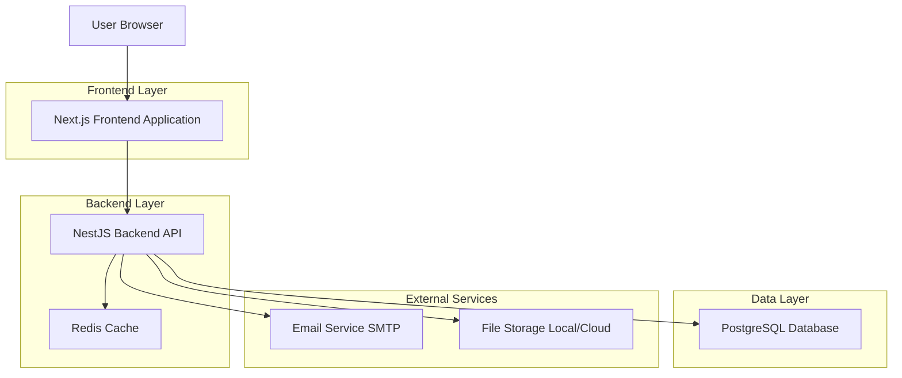
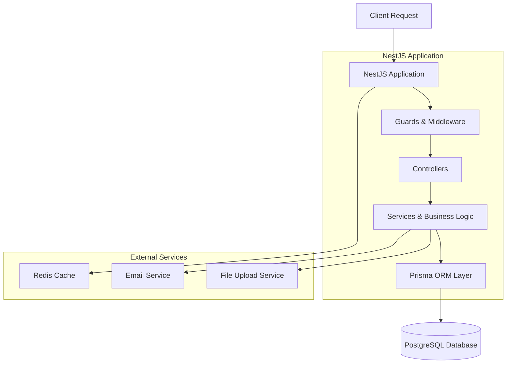
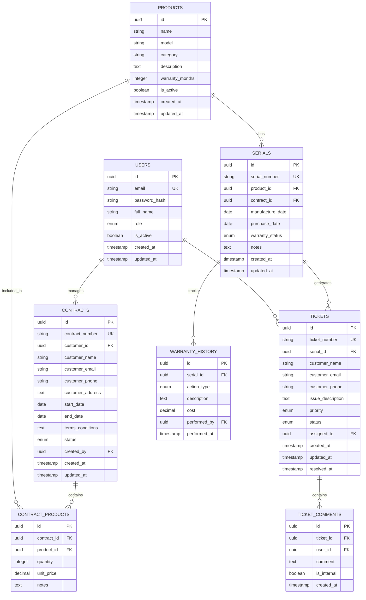

# Tài Liệu Kiến Trúc Kỹ Thuật - Hệ Thống Quản Lý Bảo Hành

## 1. Thiết Kế Kiến Trúc



## 2. Mô Tả Công Nghệ

* **Frontend**: Next.js\@14 + TypeScript + Tailwind CSS + App Router + React Query

* **Backend**: NestJS\@10 + TypeScript + Prisma ORM + JWT Authentication + Guards

* **Database**: PostgreSQL\@15 + Redis\@7 (caching)

* **Deployment**: Docker + Vercel/Railway + PM2 + Cloud VPS

## 3. Định Nghĩa Route

**Frontend Routes (Next.js App Router)**

| Route              | Mục Đích                                         |
| ------------------ | ------------------------------------------------ |
| /                  | Trang chủ với hero section và form tra cứu nhanh |
| /lookup            | Portal tra cứu bảo hành cho khách hàng           |
| /login             | Trang đăng nhập cho admin và nhân viên           |
| /dashboard         | Dashboard tổng quan với thống kê và biểu đồ      |
| /contracts         | Quản lý danh sách hợp đồng bảo hành              |
| /contracts/\[id]   | Chi tiết và chỉnh sửa hợp đồng cụ thể            |
| /contracts/new     | Tạo hợp đồng bảo hành mới                        |
| /serials           | Quản lý danh sách serial number                  |
| /serials/\[serial] | Chi tiết và lịch sử bảo hành của serial          |
| /tickets           | Hệ thống quản lý yêu cầu bảo hành                |
| /tickets/\[id]     | Chi tiết và xử lý ticket cụ thể                  |
| /reports           | Trang báo cáo và thống kê                        |
| /users             | Quản lý người dùng và phân quyền                 |
| /settings          | Cài đặt hệ thống và cấu hình                     |

**Backend API Routes (NestJS)**

| Route             | Mục Đích                                          |
| ----------------- | ------------------------------------------------- |
| /api/auth/\*      | Authentication endpoints (login, logout, refresh) |
| /api/contracts/\* | Contract management CRUD operations               |
| /api/serials/\*   | Serial number management and lookup               |
| /api/tickets/\*   | Ticket system and workflow management             |
| /api/reports/\*   | Reports and analytics endpoints                   |
| /api/users/\*     | User management and permissions                   |
| /api/lookup/\*    | Public warranty lookup endpoints                  |

## 4. Định Nghĩa API

### 4.1 Core API

**Authentication APIs (NestJS Controllers)**

```typescript
@Controller('auth')
export class AuthController {
  @Post('login')
  async login(@Body() loginDto: LoginDto) { ... }
}
```

Endpoint: `POST /api/auth/login`

Request:

| Tên Tham Số | Kiểu Dữ Liệu | Bắt Buộc | Mô Tả                 |
| ----------- | ------------ | -------- | --------------------- |
| email       | string       | true     | Email đăng nhập       |
| password    | string       | true     | Mật khẩu (plain text) |

Response:

| Tên Tham Số | Kiểu Dữ Liệu | Mô Tả                |
| ----------- | ------------ | -------------------- |
| success     | boolean      | Trạng thái đăng nhập |
| token       | string       | JWT access token     |
| user        | object       | Thông tin người dùng |

Example:

```json
{
  "email": "admin@company.com",
  "password": "123456"
}
```

**Contract Management APIs**

```typescript
@Controller('contracts')
export class ContractsController {
  @Get()
  @UseGuards(JwtAuthGuard)
  async findAll() { ... }
  
  @Post()
  @UseGuards(JwtAuthGuard)
  async create(@Body() createContractDto: CreateContractDto) { ... }
  
  @Get(':id')
  @UseGuards(JwtAuthGuard)
  async findOne(@Param('id') id: string) { ... }
  
  @Put(':id')
  @UseGuards(JwtAuthGuard)
  async update(@Param('id') id: string, @Body() updateContractDto: UpdateContractDto) { ... }
  
  @Delete(':id')
  @UseGuards(JwtAuthGuard)
  async remove(@Param('id') id: string) { ... }
}
```

**Serial Management APIs**

```typescript
@Controller('serials')
export class SerialsController {
  @Get()
  @UseGuards(JwtAuthGuard)
  async findAll() { ... }
  
  @Post()
  @UseGuards(JwtAuthGuard)
  async create(@Body() createSerialDto: CreateSerialDto) { ... }
  
  @Get(':serial')
  async findBySerial(@Param('serial') serial: string) { ... }
  
  @Put(':serial')
  @UseGuards(JwtAuthGuard)
  async update(@Param('serial') serial: string, @Body() updateSerialDto: UpdateSerialDto) { ... }
  
  @Get(':serial/history')
  async getHistory(@Param('serial') serial: string) { ... }
}
```

**Warranty Lookup API**

```typescript
@Controller('lookup')
export class LookupController {
  @Get(':serial')
  @Public() // No authentication required
  async lookupWarranty(@Param('serial') serial: string) { ... }
}
```

Endpoint: `GET /api/lookup/:serial`

Request:

| Tên Tham Số | Kiểu Dữ Liệu | Bắt Buộc | Mô Tả                  |
| ----------- | ------------ | -------- | ---------------------- |
| serial      | string       | true     | Serial number sản phẩm |

Response:

| Tên Tham Số | Kiểu Dữ Liệu | Mô Tả                     |
| ----------- | ------------ | ------------------------- |
| found       | boolean      | Tìm thấy serial hay không |
| product     | object       | Thông tin sản phẩm        |
| warranty    | object       | Thông tin bảo hành        |
| contract    | object       | Thông tin hợp đồng        |

**Ticket Management APIs**

```typescript
@Controller('tickets')
export class TicketsController {
  @Get()
  @UseGuards(JwtAuthGuard)
  async findAll(@Query() query: TicketQueryDto) { ... }
  
  @Post()
  async create(@Body() createTicketDto: CreateTicketDto) { ... }
  
  @Get(':id')
  @UseGuards(JwtAuthGuard)
  async findOne(@Param('id') id: string) { ... }
  
  @Put(':id')
  @UseGuards(JwtAuthGuard)
  async update(@Param('id') id: string, @Body() updateTicketDto: UpdateTicketDto) { ... }
  
  @Post(':id/comments')
  @UseGuards(JwtAuthGuard)
  async addComment(@Param('id') id: string, @Body() commentDto: CreateCommentDto) { ... }
}
```

**Reports APIs**

```typescript
@Controller('reports')
export class ReportsController {
  @Get('dashboard')
  @UseGuards(JwtAuthGuard)
  async getDashboardStats() { ... }
  
  @Get('contracts')
  @UseGuards(JwtAuthGuard)
  async getContractReports(@Query() query: ReportQueryDto) { ... }
  
  @Get('products')
  @UseGuards(JwtAuthGuard)
  async getProductReports(@Query() query: ReportQueryDto) { ... }
  
  @Get('tickets')
  @UseGuards(JwtAuthGuard)
  async getTicketReports(@Query() query: ReportQueryDto) { ... }
  
  @Post('export')
  @UseGuards(JwtAuthGuard)
  async exportReport(@Body() exportDto: ExportReportDto) { ... }
}
```

## 5. Sơ Đồ Kiến Trúc Server



## 6. Mô Hình Dữ Liệu

### 6.1 Định Nghĩa Mô Hình Dữ Liệu



### 6.2 Data Definition Language

**Users Table**

```sql
-- Tạo bảng người dùng
CREATE TABLE users (
    id UUID PRIMARY KEY DEFAULT gen_random_uuid(),
    email VARCHAR(255) UNIQUE NOT NULL,
    password_hash VARCHAR(255) NOT NULL,
    full_name VARCHAR(100) NOT NULL,
    role VARCHAR(20) DEFAULT 'employee' CHECK (role IN ('admin', 'manager', 'employee', 'customer')),
    is_active BOOLEAN DEFAULT true,
    created_at TIMESTAMP WITH TIME ZONE DEFAULT NOW(),
    updated_at TIMESTAMP WITH TIME ZONE DEFAULT NOW()
);

-- Tạo index
CREATE INDEX idx_users_email ON users(email);
CREATE INDEX idx_users_role ON users(role);
CREATE INDEX idx_users_active ON users(is_active);
```

**Contracts Table**

```sql
-- Tạo bảng hợp đồng
CREATE TABLE contracts (
    id UUID PRIMARY KEY DEFAULT gen_random_uuid(),
    contract_number VARCHAR(50) UNIQUE NOT NULL,
    customer_id UUID,
    customer_name VARCHAR(100) NOT NULL,
    customer_email VARCHAR(255),
    customer_phone VARCHAR(20),
    customer_address TEXT,
    start_date DATE NOT NULL,
    end_date DATE NOT NULL,
    terms_conditions TEXT,
    status VARCHAR(20) DEFAULT 'active' CHECK (status IN ('active', 'expired', 'suspended', 'cancelled')),
    created_by UUID REFERENCES users(id),
    created_at TIMESTAMP WITH TIME ZONE DEFAULT NOW(),
    updated_at TIMESTAMP WITH TIME ZONE DEFAULT NOW()
);

-- Tạo index
CREATE INDEX idx_contracts_number ON contracts(contract_number);
CREATE INDEX idx_contracts_customer ON contracts(customer_email);
CREATE INDEX idx_contracts_status ON contracts(status);
CREATE INDEX idx_contracts_dates ON contracts(start_date, end_date);
```

**Products Table**

```sql
-- Tạo bảng sản phẩm
CREATE TABLE products (
    id UUID PRIMARY KEY DEFAULT gen_random_uuid(),
    name VARCHAR(200) NOT NULL,
    model VARCHAR(100) NOT NULL,
    category VARCHAR(50),
    description TEXT,
    warranty_months INTEGER DEFAULT 12,
    is_active BOOLEAN DEFAULT true,
    created_at TIMESTAMP WITH TIME ZONE DEFAULT NOW(),
    updated_at TIMESTAMP WITH TIME ZONE DEFAULT NOW()
);

-- Tạo index
CREATE INDEX idx_products_name ON products(name);
CREATE INDEX idx_products_model ON products(model);
CREATE INDEX idx_products_category ON products(category);
```

**Serials Table**

```sql
-- Tạo bảng serial
CREATE TABLE serials (
    id UUID PRIMARY KEY DEFAULT gen_random_uuid(),
    serial_number VARCHAR(100) UNIQUE NOT NULL,
    product_id UUID REFERENCES products(id),
    contract_id UUID REFERENCES contracts(id),
    manufacture_date DATE,
    purchase_date DATE,
    warranty_status VARCHAR(20) DEFAULT 'active' CHECK (warranty_status IN ('active', 'expired', 'void')),
    notes TEXT,
    created_at TIMESTAMP WITH TIME ZONE DEFAULT NOW(),
    updated_at TIMESTAMP WITH TIME ZONE DEFAULT NOW()
);

-- Tạo index
CREATE INDEX idx_serials_number ON serials(serial_number);
CREATE INDEX idx_serials_product ON serials(product_id);
CREATE INDEX idx_serials_contract ON serials(contract_id);
CREATE INDEX idx_serials_status ON serials(warranty_status);
```

**Tickets Table**

```sql
-- Tạo bảng ticket
CREATE TABLE tickets (
    id UUID PRIMARY KEY DEFAULT gen_random_uuid(),
    ticket_number VARCHAR(50) UNIQUE NOT NULL,
    serial_id UUID REFERENCES serials(id),
    customer_name VARCHAR(100) NOT NULL,
    customer_email VARCHAR(255),
    customer_phone VARCHAR(20),
    issue_description TEXT NOT NULL,
    priority VARCHAR(10) DEFAULT 'medium' CHECK (priority IN ('low', 'medium', 'high', 'urgent')),
    status VARCHAR(20) DEFAULT 'new' CHECK (status IN ('new', 'in_progress', 'pending', 'resolved', 'closed')),
    assigned_to UUID REFERENCES users(id),
    created_at TIMESTAMP WITH TIME ZONE DEFAULT NOW(),
    updated_at TIMESTAMP WITH TIME ZONE DEFAULT NOW(),
    resolved_at TIMESTAMP WITH TIME ZONE
);

-- Tạo index
CREATE INDEX idx_tickets_number ON tickets(ticket_number);
CREATE INDEX idx_tickets_serial ON tickets(serial_id);
CREATE INDEX idx_tickets_status ON tickets(status);
CREATE INDEX idx_tickets_priority ON tickets(priority);
CREATE INDEX idx_tickets_assigned ON tickets(assigned_to);
```

**Dữ liệu khởi tạo**

```sql
-- Tạo tài khoản admin mặc định
INSERT INTO users (email, password_hash, full_name, role) VALUES 
('admin@company.com', '$2b$10$hash_password_here', 'System Administrator', 'admin'),
('manager@company.com', '$2b$10$hash_password_here', 'Warranty Manager', 'manager'),
('employee@company.com', '$2b$10$hash_password_here', 'Support Staff', 'employee');

-- Tạo sản phẩm mẫu
INSERT INTO products (name, model, category, warranty_months) VALUES 
('Laptop Dell Inspiron', 'DELL-INS-15-3000', 'Electronics', 24),
('Máy giặt Samsung', 'SAM-WM-8KG-2024', 'Home Appliances', 36),
('Điện thoại iPhone', 'APPLE-IP15-PRO', 'Mobile', 12);
```

